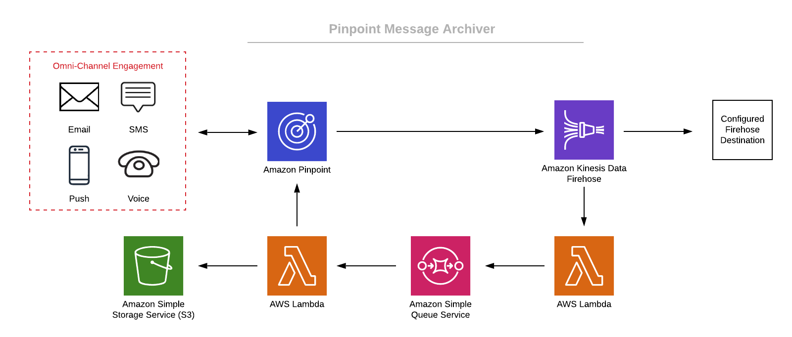
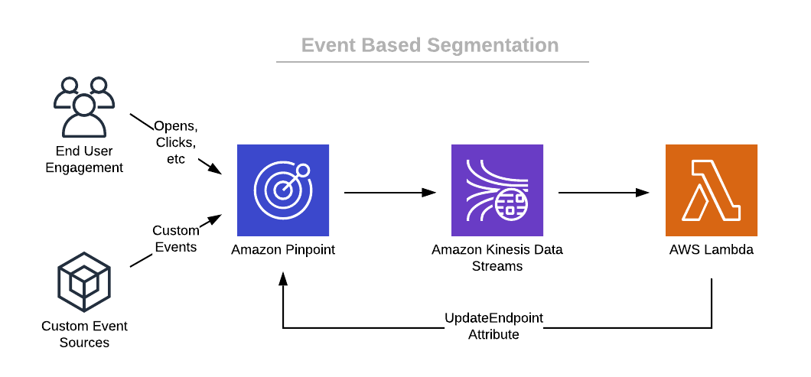
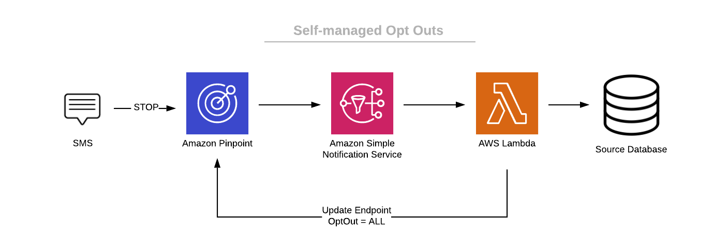
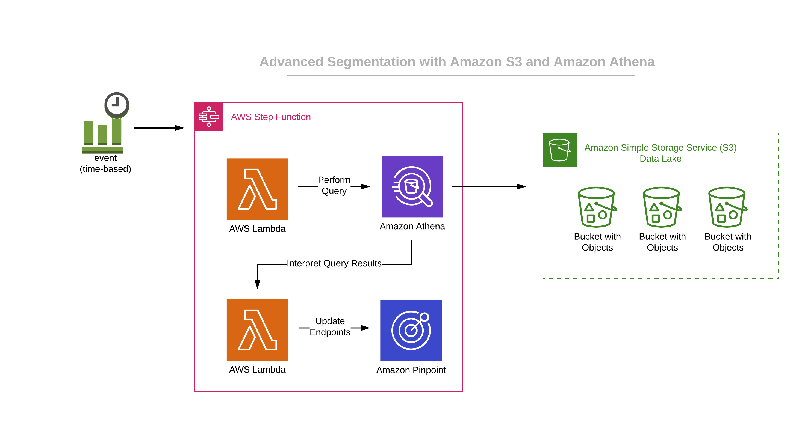
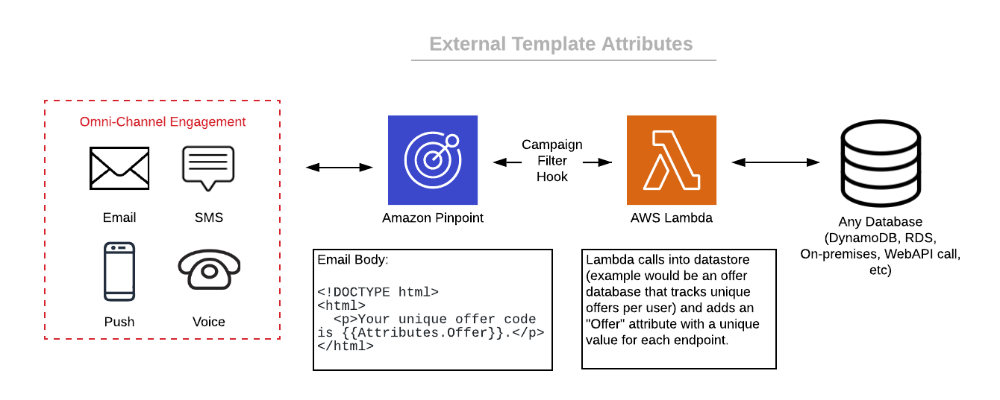
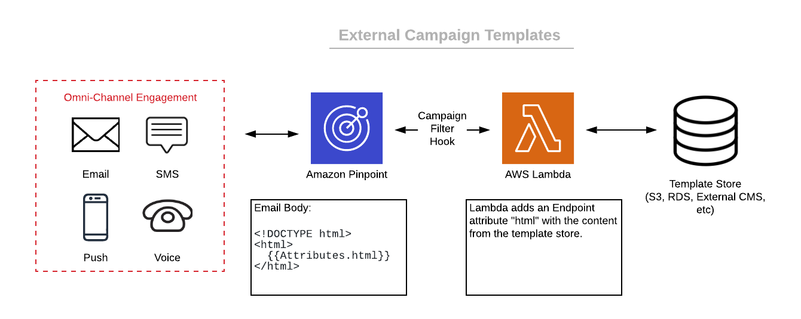

# AWS Digital User Engagement Reference Architectures

A repository of reference architectures for AWS Digital User Engagement services, Amazon Pinpoint and Amazon Simple Email Service (SES), and other AWS services.

## Table of Contents

* [Amazon SES Basics](#user-content-amazon-ses-basics)
* [Amazon Pinpoint Basics](#user-content-amazon-pinpoint-basics)
* [Amazon Pinpoint SMS](#user-content-amazon-pinpoint-sms)
* [Amazon Pinpoint Extensibility](#user-content-amazon-pinpoint-extensibility)

------
## Amazon SES Basics

------
### SES Event Processing

#### Description

Like many other IT functions, sending emails requires operational oversight and ongoing management.  One such consideration for executing any email delivery is reputation management by means of event processing.  SES should be configured to emit events regarding email sends.  Many events can be generated by SES, but two that are of high concern are Bounces (the recipient's mail server permanently rejected the email) and Complaints (the email was successfully delivered to the recipient, however recipient marked the email as spam).  Failing to respond to these events will damage sending reputation.

The architecture below shows how SES can be configured to emit events to SNS which is then routed SQS and finally to a Lambda for processing.  The Lambda function should then evaluate the events and for Bounces and Complaints, update the email address source database and remove the offending addresses from future sends.

Additionally, the Lambda function should be configured to make use of the SES Account Level Suppression List functionality to automatically suppress this email address from future sends.  

#### Architecture Diagram


#### Use-Case

* Best Practices configuration when sending emails
* Maintain high sending reputation
* Adhere to customer complaints and feedback

#### AWS CloudFormation Link
[CF Template](cloudformation/SES_Event_Processing.yaml)

#### Documentation References

* [Amazon SES Notifications Through Amazon SNS](https://docs.aws.amazon.com/ses/latest/DeveloperGuide/monitor-sending-activity-using-notifications-sns.html)
* [Configuring Amazon SNS Notifications for Amazon SES](https://docs.aws.amazon.com/ses/latest/DeveloperGuide/configure-sns-notifications.html)
* [Amazon SNS Notification Examples for Amazon SES](https://docs.aws.amazon.com/ses/latest/DeveloperGuide/notification-examples.html)

------

## Amazon Pinpoint Basics

### Pinpoint Event Processing

#### Description

Like many other IT functions, sending emails requires operational oversight and ongoing management.  One such consideration for executing any email delivery is reputation management by means of event processing.  Pinpoint should be configured to emit events regarding email sends.  Many events can be generated by Pinpoint, but two that are of high concern are Bounces (the recipient's mail server permanently rejected the email) and Complaints (the email was successfully delivered to the recipient, however recipient marked the email as spam).  Failing to respond to these events will damage sending reputation.

Since Pinpoint uses Amazon Simple Email Service to send all emails, we can rely on the above SES Event Processing Architecture to manage bounces and complaints for both SES and Pinpoint.

#### Architecture Diagram


#### Use-Case

* Best Practices configuration when sending emails
* Maintain high sending reputation
* Adhere to customer complaints and feedback

#### AWS CloudFormation Link
[CF Template](cloudformation/SES_Event_Processing.yaml)

#### Documentation References

* [Amazon SES Notifications Through Amazon SNS](https://docs.aws.amazon.com/ses/latest/DeveloperGuide/monitor-sending-activity-using-notifications-sns.html)
* [Configuring Amazon SNS Notifications for Amazon SES](https://docs.aws.amazon.com/ses/latest/DeveloperGuide/configure-sns-notifications.html)
* [Amazon SNS Notification Examples for Amazon SES](https://docs.aws.amazon.com/ses/latest/DeveloperGuide/notification-examples.html)

------

### Pinpoint S3 Event Database

#### Description

Sending outbound messages with Pinpoint allows you to track engagement events both in the Pinpoint console and programmatically by consuming the raw events that Pinpoint (and SES) generate.  These events provide a wealth of knowledge on how your end-users are engaging with your messaging and Pinpoint allows you to stream these events to S3 to create a data lake which is excellent for mining, analysis, and future machine learning training and retraining.  

The architecture below shows how Pinpoint can be configured to emit events through Kinesis Firehose into Amazon S3. SES will also be configured to use Pinpoint as an Event Destination, using the SESv2 API, to route all SES email events into the same S3 destination.  Finally, it will register the event schema with Athena and Glue to create a single table for all events, and a series of Views, one for each event type.

This enables Athena Queries to be run against each event type as a flattened view, allowing for queries like:

Ex: Get all Campaigns with Opens, Clicks, Hard Bounces, Soft Bounces, and Unsubscribes
```
SELECT
  pinpoint_campaign_id,
  (SELECT COUNT(*) FROM email_send WHERE email_send.pinpoint_campaign_id = campaign_send.pinpoint_campaign_id) AS NumSends,
  (SELECT COUNT(*) FROM email_open WHERE email_open.pinpoint_campaign_id = campaign_send.pinpoint_campaign_id) AS NumOpens,
  (SELECT COUNT(*) FROM email_click WHERE email_click.pinpoint_campaign_id = campaign_send.pinpoint_campaign_id) AS NumClicks,
  (SELECT COUNT(*) FROM email_hardbounce WHERE email_hardbounce.pinpoint_campaign_id = campaign_send.pinpoint_campaign_id) AS NumHardBounces,
  (SELECT COUNT(*) FROM email_softbounce WHERE email_softbounce.pinpoint_campaign_id = campaign_send.pinpoint_campaign_id) AS NumSoftBounces,
  (SELECT COUNT(*) FROM email_unsubscribe WHERE email_unsubscribe.pinpoint_campaign_id = campaign_send.pinpoint_campaign_id) AS NumUnsubs

FROM campaign_send
WHERE ingest_timestamp > current_timestamp - interval '30' day
GROUP BY pinpoint_campaign_id


```

Ex: Find all emails received by an email address in the last 30 days and check to see if it was opened
```
SELECT
  a.event_timestamp as WhenSent,
  a.subject as EmailSubject,
  CASE WHEN b.event_timestamp IS NULL THEN 0 ELSE 1 END as DidOpen
FROM email_send a
LEFT JOIN email_open b
  ON a.message_id = b.message_id
WHERE contains(a.destination, 'example_address@example.com')
  AND a.ingest_timestamp > current_timestamp - interval '30' day
ORDER BY a.event_timestamp DESC
```

#### Architecture Diagram


#### Use-Case

* Data Mining
* Engagement Scoring
* Engagement Analysis
* Campaign Reporting
* Click and Open Tracking
* Machine Learning Training / Retraining

#### AWS CloudFormation Link
[CF Template](https://s3.amazonaws.com/solutions-reference/digital-user-engagement-events-database/v1.0.0/digital-user-engagement-events-database.template)

#### Documentation References

* [Streaming Amazon Pinpoint Events to Kinesis](https://docs.aws.amazon.com/pinpoint/latest/developerguide/event-streams.html)
* [Setting Up Event Streaming](https://docs.aws.amazon.com/pinpoint/latest/developerguide/event-streams-setup.html)
* [Monitoring Using Amazon SES Event Publishing](https://docs.aws.amazon.com/ses/latest/DeveloperGuide/monitor-using-event-publishing.html)
* [Setting Up Amazon SES Event Publishing](https://docs.aws.amazon.com/ses/latest/DeveloperGuide/event-publishing-setting-up.html)
* [Set Up a Kinesis Data Firehose Event Destination for Amazon SES Event Publishing](https://docs.aws.amazon.com/ses/latest/DeveloperGuide/event-publishing-add-event-destination-firehose.html)
* [Populating the AWS Glue Data Catalog](https://docs.aws.amazon.com/glue/latest/dg/populate-data-catalog.html)
* [Amazon Athena - Working with Views](https://docs.aws.amazon.com/athena/latest/ug/views.html)

------

### Pinpoint Message Archiver

#### Description

Many organizations need to keep records of messages sent to end-users.  Using the Pinpoint Event Stream, we are able to archive all Campaign and Journey messages reliably in Amazon S3 by re-rendering the message using the content provided.  

The Architecture below shows how an Archiving solution could be built by attaching an AWS Lambda function to an existing Kinesis Firehose used as a Pinpoint Event Stream.  We configure the Lambda function to look for the `_campaign.send` and `_journey.send events` processing the archival asynchronously using Amazon Simple Queue Service.

The result are MIME-typed files stored in Amazon S3 with the Key Prefix: /archive/[EndpointId]/[Year]/[Month]/[Day]/[Hour].  This allows for easy GDPR compliance by enabling deletion of all messages belonging to the same Endpoint ID very quickly.

#### Architecture Diagram



#### Use-Case
* Compliance requiring historical record of all messages sent to an Endpoint
* Better customer service being able to lookup each messages sent to a user


#### AWS CloudFormation Link
[CF Template](https://due-solution-temp.s3.amazonaws.com/amazon-pinpoint-message-archiver/v0.0.1/amazon-pinpoint-message-archiver.template)

[Lambda Source](lambda/Message_Archiver)

#### Documentation References

* [Campaign Events](https://docs.aws.amazon.com/pinpoint/latest/developerguide/event-streams-data-campaign.html)
* [Journey Events](https://docs.aws.amazon.com/pinpoint/latest/developerguide/event-streams-data-journey.html)
* [Amazon Kinesis Data Firehose Data Transformation](https://docs.aws.amazon.com/firehose/latest/dev/data-transformation.html)

------

### Add / Remove from Segments via Event Activity

#### Description

Amazon Pinpoint can act as an event hub for events generated by engaging with end users (Email Opens, Email Clicks, Email Complaints, SMS Sends, etc).  Pinpoint can also be used to stream custom events from applications via the PutEvents API.  This is how AWS Amplify sends events to Pinpoint about mobile and web applications.  All of these events can be streamed out of Pinpoint via the Pinpoint Event Stream allowing all of these events to be routed to the same destination for processing or storage.  A common pattern is to use these events to target endpoints into Pinpoint Segments.  Pinpoint's Dynamic Segment functionality allows for users to generate segments for Campaign or Journey targeting based on custom endpoint attributes.

The architecture below shows how an AWS Lambda function can be used to read the events coming from the Pinpoint event stream via Kinesis in order to find specific events that will trigger Endpoint attributes to be updated in near real time.  The deployed Lambda function looks for email open events and custom webinar registration events.

Using this example, a marketer could create a Dynamic Segment in Pinpoint of users who have opened an email (attribute "email_opened" = "true") and who have registered for Webinar 5 (attribute "webinar_registration" = "webinar5").  This segment will be continuously updated so that Campaigns and Journeys would always have the most recent data.

#### Architecture Diagram



#### Use-Case

* Using Event Data to create dynamic segments
* Target Users with Campaigns based on custom events
* Target Users with Journeys based on custom events

#### AWS CloudFormation Link
[CF Template](cloudformation/Event_Based_Segmentation.yaml)

#### Documentation References

* [Streaming Amazon Pinpoint Events to Kinesis](https://docs.aws.amazon.com/pinpoint/latest/developerguide/event-streams.html)
* [Reporting Events in Your Application](https://docs.aws.amazon.com/pinpoint/latest/developerguide/integrate-events.html)
* [Pinpoint API - Events API](https://docs.aws.amazon.com/pinpoint/latest/apireference/apps-application-id-events.html)
* [Building Segments](https://docs.aws.amazon.com/pinpoint/latest/userguide/segments-building.html)

------


## Amazon Pinpoint SMS

------

### Self-Managed Opt Outs

#### Description

Managing communication preferences for the SMS channel are very important.  The STOP keyword is an important keyword to monitor when sending out SMS messages to end-users.  By default, AWS will manage the STOP keyword (and other related keywords) on your behalf.  If customers respond with STOP, then AWS will put that phone number on a blacklist per AWS account thereby blocking further communication with that end-user.  This will keep you in compliance will sending SMS messages, but it is not ideal for transactional messaging such as One-Time Passwords, Confirmation Messages, or Receipts.

Amazon Pinpoint allows you to configure Self-Managed Opt Outs which will allow you to bypass AWS's built in controls.  The architecture outlined below takes deploys an SNS Topic and Lambda function that will listen to and respond to the STOP keyword in two-way SMS conversations.

#### Architecture Diagram



#### Use-Case

* Adhere to STOP keyword compliance rules
* Still allow for sending Transactional messaging after STOP keyword
* Used in One-Time Password, Confirmation, and Receipt messaging
* Allow other customer systems to be notified of STOP triggers

#### AWS CloudFormation Link
[CF Template](cloudformation/Self-managed_Opt_Outs.yaml)

_NOTE_: Amazon Pinpoint does not allow you to configure two-way SMS or self-managed opt outs via API.  This can only be done via the Console.  After deploying the CloudFormation template, go into Pinpoint and turn on both Two-Way SMS, selecting the newly deployed SNS Topic, and also Self-Managed Opt Out per the documentation linked below.

#### Documentation References

* [Managing the Amazon Pinpoint SMS Channel](https://docs.aws.amazon.com/pinpoint/latest/userguide/channels-sms-manage.html)
* [Using Two-Way SMS Messaging in Amazon Pinpoint](https://docs.aws.amazon.com/pinpoint/latest/userguide/channels-sms-two-way.html)
* [SMS and Voice Settings](https://docs.aws.amazon.com/pinpoint/latest/userguide/settings-sms.html)

------

### Sending SMS Triggered by S3 File Drop

#### Description

Amazon Pinpoint's SendMessages API can be used to send both Transactional and Promotional SMS messages.  This repository shows how to use a CSV file drop in Amazon S3 to trigger a send via Amazon Pinpoint.

Many times, third party tools can be used to generate a targeted list of users for an SMS campaign.  By dropping a file into S3, we can trigger the SMS messages to go out within milliseconds.  

This solution takes advantages of an Amazon SQS FIFO Queue to ensure that we are able to control the concurrency of AWS Lambda functions being invoked as to not cause throttling exceptions.  If using SMS Long Codes, it might be smart to include a Sleep(xxx) as long codes are limited to 1 per second.  Short codes have a default rate limit of 100 per second.

This solution is written in Python and uses a CloudFormation Template.

This solution expects a CSV file as per the [example file](examples/sample_file.csv).  If making changes, please review both Lambda functions.

Prereqs:
* Name of a unique Amazon S3 Bucket to create
* Amazon Pinpoint Project setup
* A short or long code provisioned in Amazon Pinpoint

#### Architecture Diagram


#### AWS CloudFormation Link
[CF Template](cloudformation/SMS_S3_drop.yaml)

#### Documentation References
* [Pinpoint Messages API](https://docs.aws.amazon.com/pinpoint/latest/apireference/apps-application-id-messages.html)
* [Using AWS Lambda with Amazon S3](https://docs.aws.amazon.com/lambda/latest/dg/with-s3.html)

------

## Amazon Pinpoint Extensibility

------

### Advanced Segmentation with Amazon S3 and Amazon Athena

#### Description

Endpoints stored in Amazon Pinpoint enable customers to store addresses across multiple channels all connected to each other via a UserId to represent a single user.  Endpoints also enable you to store User and Endpoint level attributes to be used in Message personalization and Dynamic Segmentation.  This allows for segmentation like "Where [Attribute Name] is [Some Value]".  Ex:  Select all Email endpoints where the User `CustomerStage` is `Renewal` and User `CustomerValue` is `High`.

Some segmentation use-cases call for more advanced segmentation rules where simple attribute matching will not be sufficient. In these cases, we can use customer's existing Data Lakes in Amazon S3 with Amazon Athena as a query engine.  With these services, customers can create segments with much more specificity. Ex: Select all Email endpoints where the User has made a purchase of red shoes in the last 3 months and has opened more than 15 emails in the last 9 months and has clicked on the website page showing product details of our upcoming shoe release in the last 24 hours.

One option is to create a static import segment from these results that is updated daily.  Another option, and represented in the diagram below, is to update an Endpoint attribute array `AdvancedSegmentTarget` with a token signaling they match the criteria.  The `AdvancedSegmentTarget` array would then contain the names of all of the advanced segments the endpoint matches.  This allows the dynamic segment to be better used in Journeys and Recurring campaigns.  This process could be set up to refresh daily via Amazon CloudWatch events and orchestrated by AWS Step Function.

#### Architecture Diagram



#### Use-Case

* Advanced segmentation rules
* Utilize existing S3 Data Lakes
* Avoid moving data into Pinpoint Attributes that changes frequently

#### AWS CloudFormation Link
[CF Template](cloudformation/Advanced_Segmentation_S3.yaml)

#### Documentation References

* [Amazon S3 as the Data Lake Storage Platform](https://docs.aws.amazon.com/whitepapers/latest/building-data-lakes/amazon-s3-data-lake-storage-platform.html)
* [What is Amazon Athena?](https://docs.aws.amazon.com/athena/latest/ug/what-is.html)
* [How Step Functions Works](https://docs.aws.amazon.com/step-functions/latest/dg/how-step-functions-works.html)
* [Adding Endpoints to Amazon Pinpoint](https://docs.aws.amazon.com/pinpoint/latest/developerguide/audience-define-endpoints.html)

------

### Send-Time Amazon Pinpoint Campaign Attributes

#### Description

In a typical Marketing Platform, in order to use a value in an email, it must exist inside the Marketing Platform.  This typically involves creating Pipeline processes to select, transform, transfer, and load data from source systems into the Marketing Platform at regular intervals to sync it.  This causes data latency if the data changes frequently, but can also cause long development delays when Marketers want to onboard new sources of data for use in Campaigns.

With Amazon Pinpoint's CampaignHook functionality, data can be retrieved at the time of Campaign execution from any source via a Lambda function that is called in realtime.  The architecture diagram below shows how a Lambda function could be used to fetch a personalized offer from a source data store to be used in the email html without storing the offer in Pinpoint.

#### Architecture Diagram



#### Use-Case

* Retrieving data in real time with no latency
* Avoid costly and time consuming ETL processes
* Onboard new attributes dynamically

#### AWS CloudFormation Link
[CF Template](cloudformation/External_Attributes.yaml)

#### Documentation References

* [Customizing Segments with AWS Lambda](https://docs.aws.amazon.com/pinpoint/latest/developerguide/segments-dynamic.html)

------


### External Amazon Pinpoint Campaign Templates

#### Description

Amazon Pinpoint has template management functionality to managed your Email, SMS, Push, and Voice templates for your campaigns.  Many customers, however, already have content in other systems driven by the needs of the Creative team.  Pinpoint is flexible and extensible in that it can fetch whole HTML content from other sources at send time.  

With Amazon Pinpoint's CampaignHook functionality, html and subject lines can be retrieved at the time of Campaign execution from any source via a Lambda function that is called in realtime.  The architecture diagram below shows how a Lambda function could be used to fetch html from a source data store to be used in the campaign.

#### Architecture Diagram



#### Use-Case

* Templates stored in a Content Management System
* Templates managed and owned by separate creative team
* Complex business rules where templates can be internationalized an selected at campaign send time
* Build your own templating engine outside of Pinpoint

#### AWS CloudFormation Link
[CF Template](cloudformation/External_Templates.yaml)

_NOTE_: In the campaign, a message body would need to be used to minimally render the dynamic attribute "html".  An example email body would be:
```
<!DOCTYPE html>
<html>{Attributes.html}</html>
```

#### Documentation References

* [Customizing Segments with AWS Lambda](https://docs.aws.amazon.com/pinpoint/latest/developerguide/segments-dynamic.html)


------

### Connect (or Facebook, WhatsApp, Twitter, anything) as a Pinpoint Campaign Channel

#### Description

Amazon Pinpoint has a voice channel that can be used to place outbound calls and play a message.  Amazon Connect is a separate AWS service that has full call center capabilities.  Commonly, customers will want to use Pinpoint's campaign functionality to filter and identify customers to target for an interactive outbound call.

With Amazon Pinpoint's CampaignHook functionality, Amazon Connect can be set up as a custom channel via a Lambda function.  The architecture diagram below shows how a Lambda function could be used to initiate a realtime call to Connect to place an outbound call.

It is important to note that this same Lambda Pinpoint CampaignHook feature can be used to build any custom channel.  Customers are not limited to other AWS services.

#### Architecture Diagram


#### Use-Case

* Appointment Confirmation:  You have an appointment soon.  Push 1 to confirm, Press 2 to speak to someone about rescheduling
* Automatically connect customers to agents
* Use an advanced IVR system for interactivity with customers

#### AWS CloudFormation Link
[CF Template](cloudformation/Connect_as_a_Channel.yaml)


_NOTE_: This example uses the Pinpoint channel type of SMS.  Via the UI, a message can be passed to the Lambda function by providing an SMS message during the Campaign creation process.  

This also assumes that an Amazon Connect Instance, Queue, and Contact Flow have been set up and created prior to launching the CloudFormation template.  These are required parameters for the template.

#### Documentation References

* [Creating Custom Channels with AWS Lambda](https://docs.aws.amazon.com/pinpoint/latest/developerguide/channels-custom.html)
* [Automating outbound calling to customers using Amazon Connect](https://aws.amazon.com/blogs/contact-center/automating-outbound-calling-to-customers-using-amazon-connect/)
* [Connect API - StartOutboundVoiceContact](https://docs.aws.amazon.com/connect/latest/APIReference/API_StartOutboundVoiceContact.html)
* [IoT Channel Using Amazon Pinpoint](https://aws.amazon.com/solutions/iot-channel-using-amazon-pinpoint/)

***


## License

This library is licensed under the MIT-0 License. See the LICENSE file.
